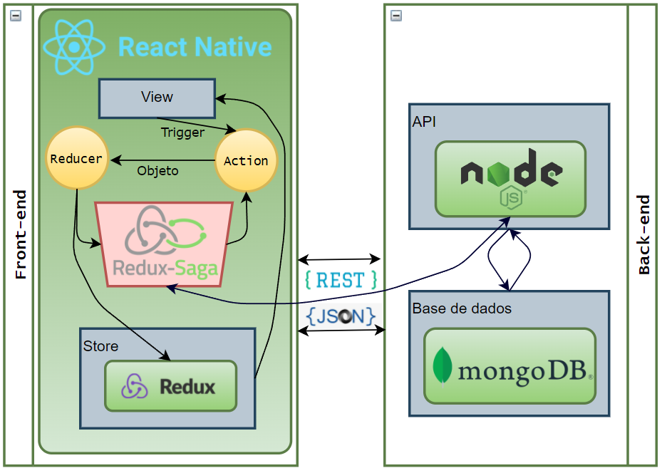
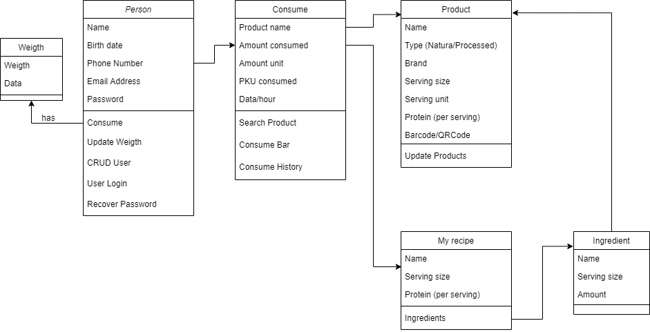
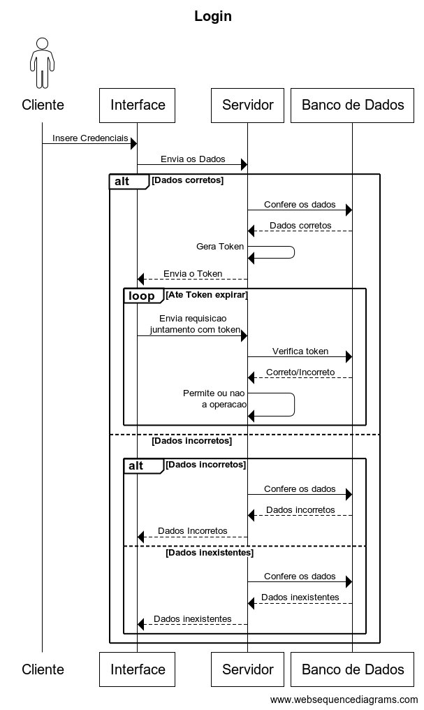
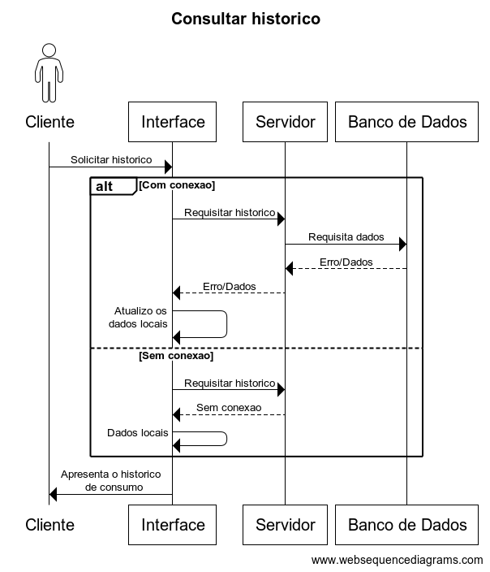

# Sobre o aplicativo
&nbsp; &nbsp; O PKU Monitor é um aplicativo móvel para o acompanhamento dietoterápico de portadores de fenilcetonúria, doença que, a partir do diagnóstico no recém-nascido (por meio do Teste do Pezinho), requer acompanhamento constante, a fim de evitar prejuízos ao desenvolvimento. 

&nbsp; &nbsp;  A fenilcetonúria (PKU) é uma doença genética que não tem cura. A única forma de controlar e/ou retardar seus efeitos é controlando a ingestão de PHE, aminoácido presente na proteína dos alimentos. Atualmente, há disponíveis poucos aplicativos mobiles para auxílio ao paciente com PKU, i.e. My diet for PKU (sendo mais focado para balanço nutricional de algumas vitaminas e minerais na dieta do paciente), Dietassistant for PKU, PKU manager. Todos possuem apenas versões em inglês, sem leitor de código de barras, necessitando que o usuário insira manualmente a quantidade de proteínas para que o software faça os cálculos.

&nbsp; &nbsp;  O aplicativo proposto permite, a partir dos registros quanti/qualitativo dos alimentos consumidos, mensurar a quantidade de fenilalanina ingerida. Desta forma, o usuário consegue evitar danos ocasionados pela ingesta em excesso, assim como deficiência protéica na alimentação de muitos fenilcetonúricos. Por ser um sistema automatizado que se baseia na tabela nutricional, há evidente redução das falhas quando comparado ao método manual usualmente aplicado pelos pacientes e cuidadores. A aplicação mobile consiste no cadastro de usuário, alteração de dados do usuário, inserção de um produto para que todos os outros usuários possam utilizá-lo, se tornando assim uma aplicação colaborativa (com armazenamento em nuvem) e o controle diário de proteína do usuário.

&nbsp; &nbsp;  Este projeto teve início em 2017, sendo objeto de um TCC (Górski et al., 2017) e continuado em 2019, em um trabalho de estágio supervisionado (Urtado & Piekarski, 2019). Frente às necessidades de atualizações tecnológicas que permitam disponibilizar uma versão funcional, foi proposto um projeto de extensão, que teve início em dezembro de 2020 (Piekarski et al., 2020). Uma nova versão está sendo desenvolvida, considerando os requisitos já existentes.

## Referencias bibliográficas 
Górski, G. V., Piekarski, A. E. T., & Freitas, G. B. L. de (2017). Aplicativo de apoio ao manejo dietoterápico para fenilcetonúria [Trabalho de Conclusão de Curso, Bacharelado em Ciência da Computação]. Unicentro, Guarapuava, PR.

Piekarski, A. E. T., Quinaia, M. A., & Freitas, G. B. L. de (2020). PKU Monitor - aplicativo de apoio a fenilcetonúria [Projeto de Extensão]. Unicentro, Guarapuava, PR. https://sguweb.unicentro.br/webrel/webrel.php?id=97&idf=5f5f5c36-f190-45d5-9fbd-d1a5c8c90a21 .

Urtado, J. V. M., & Piekarski, A. E. T. (2019). PKUMonitor: a nova versão do aplicativo PKUniverse [Relatório Final (Estágio Supervisionado), Bacharelado em Ciência da Computação]. Unicentro, Guarapuava, PR. Retrieved 09 18, 2020, from https://drive.google.com/open?id=1yDsyB3RUyvdCCC9F5mLIZZItz-Bph-UN

# Arquitetura

# Diagramas
### Diagrama de classe
  
### Diagrama Logico do banco de dados
### Diagrama de Sequencia

  
  
  
  

# Tecnologias utilizadas
## Front-End
* React

## Back-End
* JavaScript
* Nest

## Outras
* Trello
* Swagger
* GitHub
* Git
* Docker

# Equipe
* Ana Elisa Tozetto Piekarski
* Bruno de Souza Godoi Fred
* Eric Patrick Militão
* Guilherme Barroso Langoni de Freitas
* Guilherme Vinícius Górski da Silva
* Juliano Carvalho
* Luis Henrique Cheuczuk
